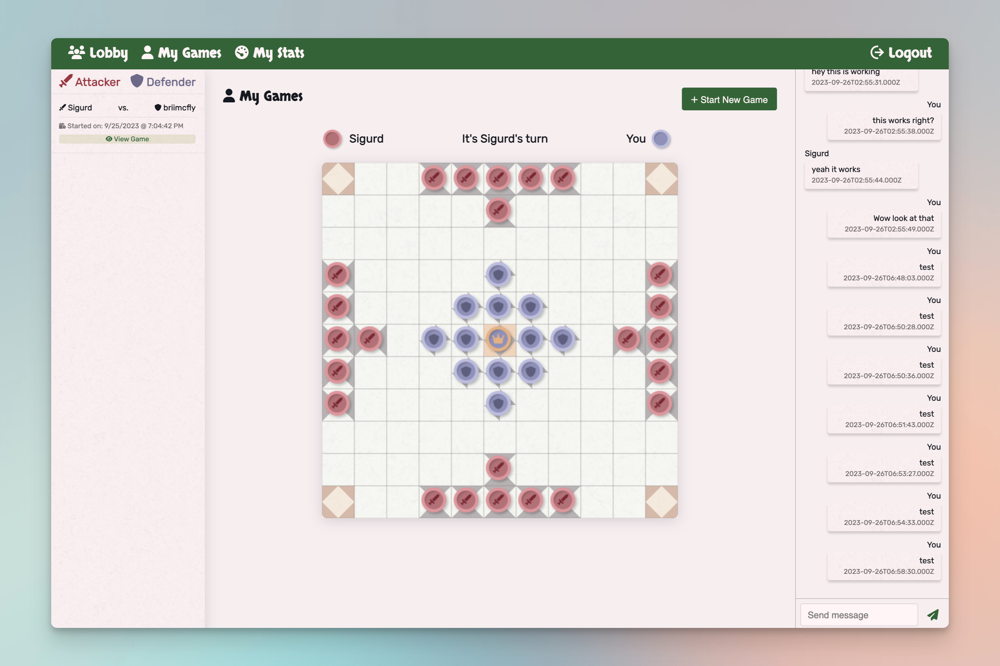

# Taflio 
TOFL Game App is a real-time multiplayer gaming platform where users can create, play, and chat with other players during the game. This platform offers a seamless and engaging gaming experience with live updates through Socket.IO, allowing users to view ongoing games and interact in real-time. The application is built using Node.js with Sequelize ORM and utilizes a MySQL database to store game state, user information, and chat messages. [View Deployed Application Here](https://toff-leo-6bd4612bd777.herokuapp.com/)

## Features 
* User Authentication: Secure sign-up and login functionalities.
* Create and Join Games: Users can create new games and join existing ones to play against other players.
* Real-Time Chat: In-game real-time chat functionality to communicate with opponents.
* Live Game Updates: View ongoing games with live updates through Socket.IO.
* Game History: Access previously played games and their results.

## Technologies Used
* Frontend: HTML, CSS, JavaScript, Handlebars
* Backend: Node.js, Express.js
* Database: MySQL
* ORM: Sequelize
* Real-Time Communication: Socket.IO

## Getting Started 
### Prerequesites 
* Node.js
* MySQL

### Installation 
... 

